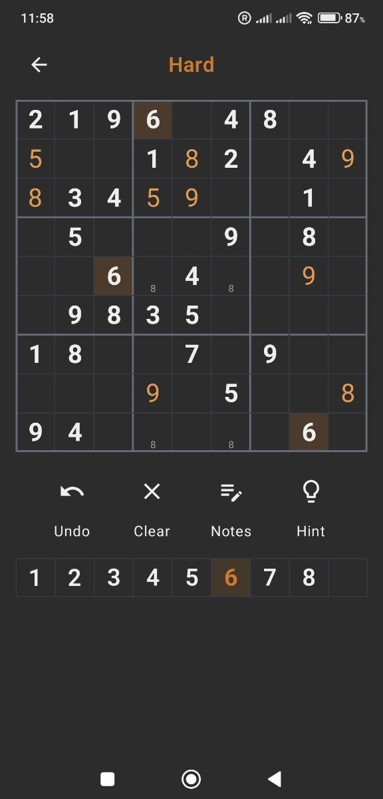

# Sudoku

A clean, minimal Sudoku app for Android built with Kotlin and Jetpack Compose.

---

## Features

- **Three difficulty levels** — Easy, Medium, Hard
- **Notes mode** — fill cells with pencil marks in a 3×3 mini-grid layout; marks auto-clear when a digit is placed in the same row, column, or box
- **Conflict highlighting** — digits that conflict with the same row, column, or box are shown in red
- **Undo** — step back through every move all the way to the start
- **Hints** — reveal a correct digit in any empty cell (unlimited)
- **Auto-complete digit row** — once a digit is placed 9 times it disappears from the number pad; reappears if undone
- **Solver** — enter any Sudoku puzzle and let the app solve it instantly
- **Motivational finish screen** — a random encouraging message when the puzzle is complete
- **Dark / light theme** — follows system setting automatically; dark gray background, white background, orange accent

## Screenshots

| Light theme | Dark theme |
|-------------|------------|
|  |  |

## Tech Stack

| Layer | Technology |
|---|---|
| Language | Kotlin |
| UI | Jetpack Compose (Material 3) |
| Architecture | ViewModel + StateFlow |
| Navigation | Navigation Compose |
| Icons | Material Icons Extended |
| Min SDK | API 26 (Android 8.0) |

## Building

1. Clone the repository
   ```bash
   git clone git@github-personal:JuliaSivridi/Sudoku.git
   cd Sudoku
   ```
2. Open in **Android Studio**
3. Connect an Android device or start an emulator
4. Click **Run ▶**

No API keys or external services required — everything runs on-device.

## How to Play

1. Pick a difficulty on the start screen
2. Tap a digit in the number row, then tap a cell to place it
3. Use **Notes** mode to pencil in candidates — they auto-clear as the board fills
4. Use **Undo** to step back, **Hint** to reveal a correct digit
5. Finish the puzzle and collect your reward 🎉

Use the **Solver** screen to solve any puzzle from a newspaper or another app — enter the given digits and tap **Solve**.
